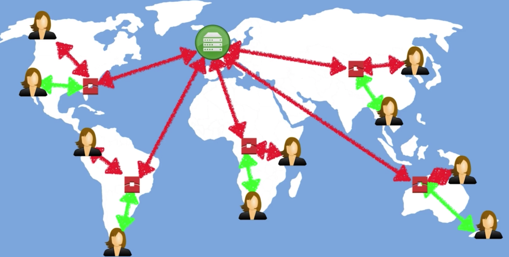

# AWS CloudFront(CDN)

A CDN (content delivery network) is a system of distributed servers (network) that deliver webpages and other web content to user based on the geographic locations of the users, the origin of the webpage and a content delivery server.

Key Terminology:

* Edge Location:
  * The location where content will be cached.
  * This is separate to an AWS Region/AZ
  * They are all around the world
  * It's not just READ only, you can write to them too, eg put an object on to them, and object will be put backup to the Origin
  * Objects are cached for the life of the TTL(time to life)

* Origin:
  * all the file the CDN will distribute
  * Can be either a S3 Bucket, an EC2 instance, an Elastic Load Balancer or Route53
* Distribution
  * This is the name given to CDN which consists of a collection of Edge Location
  * Web Distribution
    * Typically used for Websites
  * RTMP
    * Used for Media Streaming
    * For Adobe Flash Media Server's RTMP protocol

`Amazon CloudFront` can be used to deliver your `entire website`, including `dynamic`, `static`, `streaming`, and `interactive content` using a global network of `edge locations`. Requests for your content are automatically routed to the nearest edge location, so content is delivered with the best possible performance.

CloudFront also can distribute `non-AWS` origin content.
