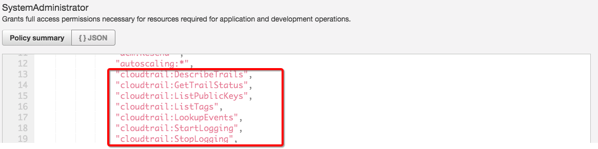

# AWS Identity Access Management (IAM)

Essentially, IAM allows you to manage users and their level of access to the AWS Console. It is important to understand IAM and how it works, both for the exam and for administrating a company's AWS account in real life.

## What does IAM give you?

* Centralised control of your AWS account
* Shared Access to your AWS account
* Granular Permissions
* Identity Federation (including Active Directory, Facebook, Linkedn etc)
* Multifactor Authentication (MFA)
  * like 2 factor authentication
* Provide temporary access for users/devices and services where necessary
* Allows you to set up your own password rotation policy
* Integrates with many different AWS services
* Supports PCI DSS Compliance

Critical Terms:

* User - End User(think people)
* Groups - A collection of users under one set of permissions
  * group user together, and apply sets of permissions
* Roles - you create roles and can then assign them to AWS resources
  * very important
  * like give EC2 a role to access S3, and you don't need to setup a username or password for that EC2
* Policies - A document that defines one (or more permissions)
  * attach policies to users/groups/roles

* IAM is global, it's universally available

* IAM users sign-in link
  * https://aws_account_number.signin.aws.amazon.com/console
  * you can customize it, like https://yangwang166.signin.aws.amazon.com/console

The root account is the account using the aws email login. The root account have the root level access. It

Root account give you unlimited access to do thing in the cloud.

So, it's not a good idea to let employee to have root level access

We may only want
* HR only have ability to read file in S3

We should use root account as minimum as possible, then create user and group, and apply policy to them

## Activate MFA on your root account

We use virtual MFA device

After registered with Google Authenticator on my iphone

## Create Individual IAM users

Then create group and set permission

Let's create a system-admins group for `yang` and `ling`, and attach some policy to this group.

For a particular Policies, can click it and check the detail in JSON tab

More policy details

> AdministratorAccess policy same as root level policy

* The `Access key ID` & `Secret access key` is the token used for programatically access aws, eg copy file from local laptop to S3
* When login to aws console, use the `User` and `Password`
* And you can only see these info once!! So keep them somewhere

We can attach policy to group also directly to user

Here we attach directly `AmazonGlacierReadOnlyAccess` policy to `ling` and she also have the policy `AmazonS3ReadOnlyAccess` from group.

## Config Password Policy

## Roles

IAM roles are a secure way to grant permissions to entities that you trust. Examples of entities includes the following:
* IAM user in another account
* Application code running on an EC2 instance that needs to perform actions on AWS resources
  * **most common**
* An AWS service that needs to act on resources in your account to provide its features
* Users from a corporate directory who use identity federation with SAML

IAM roles issue keys that are valid for short durations, making them a more secure way to grant access.

Let's say we want our EC2 instance to store file to S3

After that, we can apply this role to an EC2 instance to access S3

Let's take a look my final dashboard, which have 2 users, and 2 groups, and 3 roles, and all green for security status.

## Create a billing alarm

Create a alarm when aws account goes over $10.

The alarm will send me an email.

Sometime it's really easy to forget shutdown things.

And some AWS things `really hidden`.

One enable monitor your estimated charges, it cannot be disabled.

And it will use `CloudWatch` to monitor it.

## Wrap up

IAM consists of the following:
* User
* Groups
* Roles
* Policy Documents

IAM is universal, it does not apply to regions at this time

The 'Root account' is simply the account created when first setup your aws account, it has complete admin access

New user have no permission when first created

New user are assigned `Access Key ID & Secret Access Key` when first created

These are not the same as password, and you cannot use the Access Key ID & Secret Access Key to Login in to the console. You can use this to access AWS via API or SDK and Command Line however.

You only get to view these once. If you lose them, you have to regenerate them. So save them in a secure location

Always setup multifactor authentication on your root account

you can create and customise your own password rotation policies
