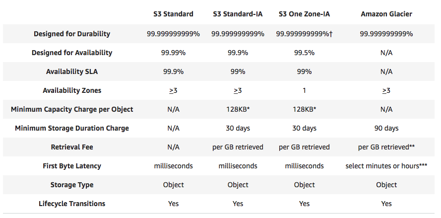

# AWS Simple Storage Service (S3)

S3 is the oldest service in aws

S3 provide developers and IT team with secure, durable, highly-scalable object storage. Amazon S3 is easy to use, with a simple web service interface to store and retrieve any amount of data from anywhere on the web.

Object-based storage
* pic
* pdf
* video

Contract to block-based storage
* install os
* install db
* install application

Basic
* File can be from 0 bytes to 5TB

* There is unlimited storage
  * pay by the G

* File are stored in Buckets
  * Bucket can be treat as a folder inside cloud
  * Bucket has a universal name, unique globally
  * each bucket you created, it has a website address(dns address)
  * url example: https://s3-ap-southeast-2.amazonaws.com/yangwang166/certificate_hdpca.pdf
  * If upload successful, you get HTTP 200 code
  * SLA (service level agreement)
    * Built for 99.99% availability for S3 platform
    * Amazon Guarantee 99.9% availability
    * Amazon guarantee 99.999999999% durability for S3 information (11x9)
      * it means you will not lose your data with 99.999999999%
  * Tiered Storage Available
  * Lifecycle Management
  * Versioning
  * Encryption
  * Secure you data using Access Control Lists and Bucket Policies
  * Storage Tier/classes
    * S3 standard:
      * 99.99% availability
      * 99.999999999% durability
      * stored redundantly across multiple devices(Disk) in multiple facilities(AZ), designed to sustain the loss of 2 facilities(AZ) concurrently.
    * S3 IA (infrequently accessed):
      * data that is accessed less frequently, but requires rapid access when needed.
      * Lower fee than S3, but you are charged a retrieval fee
      * store also cross multiple facilities and devices
    * S3 One Zone - IA:
      * cheaper than IA, in 1 zone
    * Glacier
      * cheapest
      * have 3 Model
        * Expedited: 5 min to restore
        * Standard: 3-5 hours to restore
        * Bulk: 5-12 hours to restore

https://aws.amazon.com/s3/storage-classes/

## Data Consistency Model for S3

* Read after Write consistency for PUTS of new Object
  * like upload a file, after write it to aws, you can read it, usually take milliseconds
* Eventual Consistency for overwrite PUTS and DELETES(can take some time to propagate)
  * update file, change a file, read it, you may got two result, the new one and the old one, but eventually you will only get the latest file, because s3 store file in different available zone, so need time to sync

## S3 is A Simple Key-value Store

* S3 is object based, objects consist of the following:
  * Key (this is simply the name of the object)
  * Value (this is simply the data and is made up of a sequence of bytes)
  * Version ID (important for versioning)
  * Metadata (Data about data you are storing)
  * Subresources
    * Access Control Lists
    * Torrent

## S3 - charges

* Storage
* Requests
* Storage Management Pricing
  * metadata
* Data Transfer pricing
  * from one region to another
* Transfer acceleration
  * fast, easy, secure transfer file over long distances between your end users and an S3 bucket
  * takes advantages of amazon cloudfront's globally distributed edge locations, data is routed to Amazon S3 over an optimized network path.

## S3 - Wrap up
* Remember that S3 is Object-based
  * allows you to upload files
* Files size: 0 Bytes to 5 TB
* Unlimited Storage
* Files stored in Buckets
* S3 is universal namespace. Name must be unique globally
  * eg: https://s3-ap-southeast-2.amazonaws.com/yangwang166/certificate_hdpcd_spark.pdf
* Read after write consistency for PUTs of new Objects
* Eventual Consistency for overwrite PUTs and DELETES (can take some to propagate)
* S3 Storage Class/Tiers
  * S3 (durable, immediately available, frequently accessed)
  * S3 - IA (durable, immediately available, infrequently accessed)
  * S3 One Zone - IA (even cheaper than IA, but only in 1 AZ)
  * Glacier - Archived data, where you can wait 3-5 hours before accessing
* core fundamental of s3 object
  * key(name)
  * value(data)
  * version id
  * metadata
  * subresources
    * ACL
    * Torrent
* Successful uploads will generate a HTTP 200 status code
* Read S3 FAQ:
   * https://aws.amazon.com/s3/faqs/
* Encryption
  * Client Side Encryption
  * Server Side Encryption
    * Amazon S3 managed keys(SSE-S3)
    * KMS(SSE-KMS)
    * Customer Provided Keys(SSE-C)
* Control access to buckets using either a bucket ACL or using Bucket Polices
* By default, buckets are private and all objects stored inside them are private

## S3-Versioning Tips

* Stores all versions of an object (including all writes and even if you delete an object)
* great backup tool
* once enabled, versioning cannot be disabled, only suspended
* integrates with lifecycle rules
* versioning's MFA delete capability, which use multi-factor authentication, can be used to provide an additional layer of security.

## Cross Region Replication

* useful in real life, eg store your bitcoin :-)
* Versioning must be enabled on both the source and destination buckets
* Regions must be unique
* Files in an existing bucket are not replicated automatically. All subsequent updated files will be replicated automatically
* You can not replicate to multiple buckets or use daisy chaining (at this time)
* Delete markers are replicated
* Deleting individual versions or delete markers will not be replicated
* Understand what Cross Region Replication is at a high level

## Lifecycle Management

we can add multiple transition
* 30 days from s3-standard to s3-standard-IA
* 60 days from s3-standard to glacier

Also, can expire object

Then let's see the rule we create:

* can be used in conjunction with versioning
* can be applied to current versions and previous versions
* following actions can now be done:
  * transition to the Standard - IA (30 days after creation)
  * archive to the Glacier Storage Class (30 days after IA)
* Permanently Delete

## Security & Encryption

* Securing
  * By default, all newly created buckets are private
  * You can setup access control to your buckets using:
    * Bucket Policies
    * Access Control Lists
  * S3 buckets can be configured to create access logs which log all requests make to the S3 bucket. This can be done to another bucket or another account

* Encryption
  * In Transit
    * to and from S3 bucket
    * SSL/TLS (TLS to replace SSL)
    * Using HTTPS
  * At Rest
    * Server side encryption
      * S3 Managed Keys - SSE-S3
      * AWS Key Management Service, Managed Keys - SSE-KMS
        * Audit Track
      * Server Side Encryption With Customer Provided Keys - SSE-C
        * You managed key yourself
    * Client Side encryption

## S3 Transfer Acceleration

S3 Transfer Acceleration utilises the CloudFront Edge Network to accelerate your uploads to S3. Instead of uploading directly to your S3 bucket, you can use a distinct URL to upload directly to an edge location which will then transfer that file to S3. You will get a distinct URL to upload to, eg `xxx.s3-accelerate.amazonaws.com`

* eg: `willxxxxxxation.s3-accelerate.amazonaws.com`

* A page show Speed Comparison, know how it accelerate

  * 

## Create A static website using S3

* No worry about
  * maintenance
  * service involved
  * underlying infrastructure
  * scaling
  * load balance

* domain name and s3 bucket name should be exactly the same

* website url: `bucketname.s3-website-regionname.amazonaws.com`

## Wrap up all

* Object based, upload files
* files can be from 0 to 5TB
* unlimited storage
* stored in buckets
* s3 bucket name must be unique globally, it's universal namespace
* url: https://s3-region.amazonaws.com/bucketname
* Read after Write consistency for PUTS of new Objects
* Eventual Consistency for overwrite PUTS and DELETES (can take some time to propagate)
* S3 Storage Tiers/Classes
  * S3 Standard: 99.99% availability, 99.99999999% durability, stored redundantly across multiple devices in multiple facilities, and is designed to sustain the loss of 2 facilities concurrently
  * S3 IA: Infrequently Accessed, for data that is accessed less frequently, but requires rapid access when needed. Lower fee than S3, but you are charged a retrieval fee.
  * S3 One Zone IA: want a lower-cost option for infrequently accessed data, but do not require the multiple AZ data resilience.
  * Glacier: very cheap, but used for archival only. Expedited, standard, or bulk. A standard retrieval time takes 3-5 hours.  
* Core fundamentals
  * Key: name
  * Value: data
  * Version ID
  * Metadata
  * Access control list
* object based storage only, for files
* not suitable to install an operating system on
* Versioning
  * Stores all versions of an object, including all writes and even if you delete an object
  * great backup tool
  * once enabled, versioning cannot be disabled, only suspended
  * integrate with lifecycle rules
  * versioning's MFA Delete capability, which uses multi-factor authentication, can be used to provide an additional layer of security
  * Cross Region Replication, requires versioning enabled on the source bucket
* Lifecycle Management
  * Can be used in conjunction with versioning
  * Can be applied to current versions and previous versions
  * Following action can now be done:
    * Transition to the Standard - IA storage class, (need at least 128Kb and 30 days after the creation date)
    * Archive to the Glacier Storage Class(30 days after IA, if relevant)
    * Permanently Delete
* Securing your buckets
  * By default, all newly created buckets are Private
  * You can setup access control to your buckets using:
    * Bucket Policies
    * Access control list
  * S3 buckets can be configured to create access logs which log all requests made to the S3 bucket. This can be done to another bucket
* Encryption
  * In Transit
    * SSL/TLS, HTTPS
  * At Rest
    * Server side:
      * S3 Managed Keys: SSE-S3
      * AWS Key Management Service, Managed Keys: SSE-KMS
      * Server side Encryption with customer provided keys: SSE-C
    * Client Side Encryption
* S3 Transfer Acceleration
  * speed up to S3 using S3 transfer acceleration, extra cost, and has the greatest impact on people who are in far away location
* S3 Static Website
  * S3 can host static website
  * server-less
  * very cheap, scales automatically
  * static only, cannot host dynamic sites
* write to s3 - HTTP 200 code for a successful write
* you can load files to s3 much faster by enabling multipart upload for big file
* Read S3 FAQ! It comes up A LOT!

## RRS (Reduced Redundancy Storage)

* availability is 99.99%,
* durability also is 99.99%
* RRS is an Amazon S3 storage option that enables customers to store noncritical, reproducible data at lower levels of redundancy than Amazon S3’s standard storage.
* Reduced Redundancy Storage
  * 
* S3 Tier compare
  * 

## Questions

* You run a meme creation website that frequently generates meme images. The original images are stored in S3 and the meta data about the memes are stored in DynamoDB. You need to store the memes themselves in a low cost storage solution. If an object is lost, you have created a Lambda function that will automatically recreate this meme using the original file in S3 and the metadata in Dynamodb. Which storage solution should you consider to store this non-critical, easily reproducible data on in the most cost effective solution as possible?
  * S3 - `RRS`
* You run a popular photo sharing website that is based off S3. You generate revenue from your website via paid for adverts, however you have discovered that other websites are linking directly to the images on your site, and not to the HTML pages that serve the content. This means that people are not seeing your adverts and every time a request is made to S3 to serve an image it is costing your business money. How could you resolve this issue?
  * Remove the ability for images to be served publicly to the site and then used signed URL's with expiry dates
