# EC2

* EC2 instance types
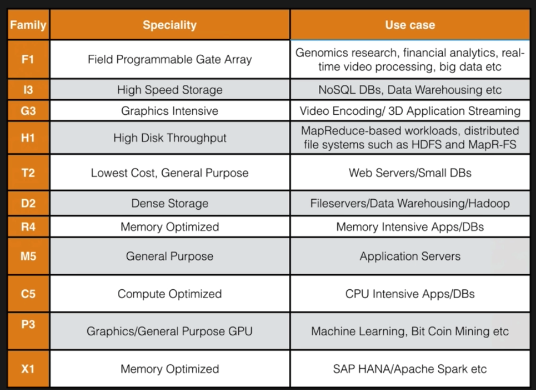

* EC2 cost model
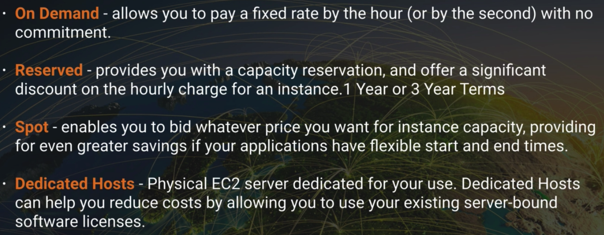
  * Spot
    * 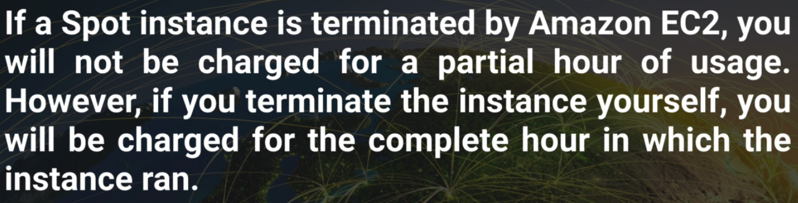

* FightDrMcPX
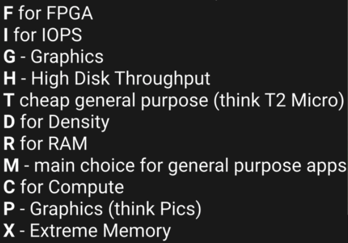

* EBS
  * A virtual disk
  * a block device
  * are placed in a specific availability zone, are automatically replicated to protect you from the failure of a single component
  * Types
    * SSD
      * General Purpose SSD (GP2)
        * balance both price and performance
        * ratio of 3 IOPS (I/O per second) per GB with up to 10,000 IOPS and the ablility to burst up to 3000 IOPS for extended periods of time for volumes at 3334 GiB and above.
      * Provisioned IOPS SSD (IO1)
        * Designed for I/O intensive applications such as large relational or NoSQL DB
        * Use if you need more than 10,000 IOPS
        * Can provision up to 20,000 IOPS per volume
    * Magnetic
      * Throughput Optimized HDD(ST1)
        * Big data
        * Data warehouse
        * Log processing
        * Cannot be a boot volume
      * Cold HDD (SC1)
        * Lowest Cost Storage for infrequently accessed workloads
        * File Server
        * Cannot be a boot volume
      * Magnetic (Standard)
        * Lowest cost per gigabyte of all EBS volume types that is bootable.
        * Magnetic volumes are ideal fro workloads where data is accessed infrequently, and applications where the lowest storage cost is important
        * Previous Generation
    * 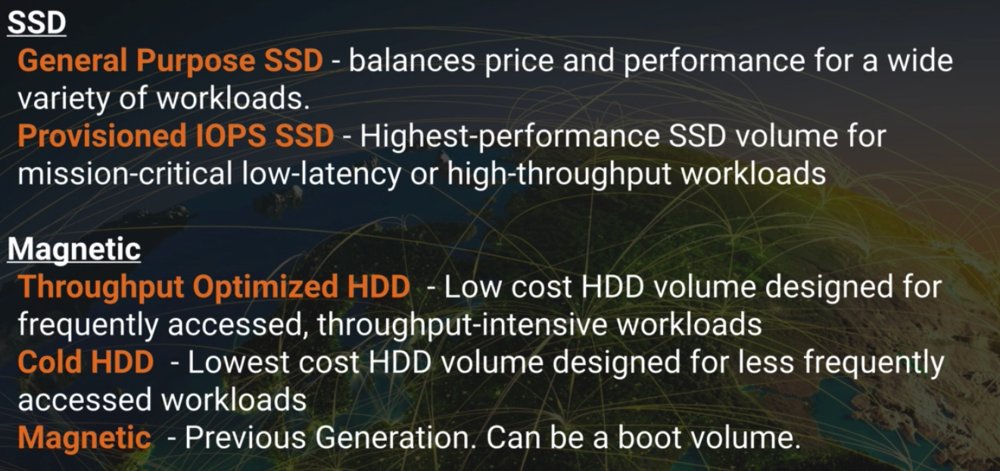

* EC2 latency test
  * https://www.cloudping.info/
  * In Perth AU
    *  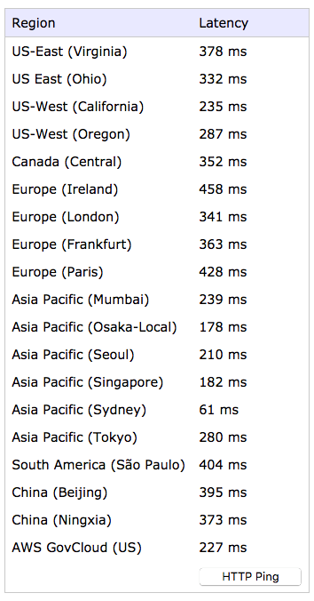

* Lunch EC2 instance
  * Step 1: choose AMI
    * 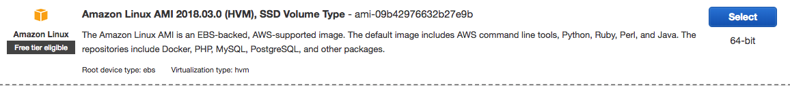
    * We need AWS command line tool, this AMI have many pre-build packages.
  * Step 2: choose instance type
    * Using t2.micro with free tier eligible
    * 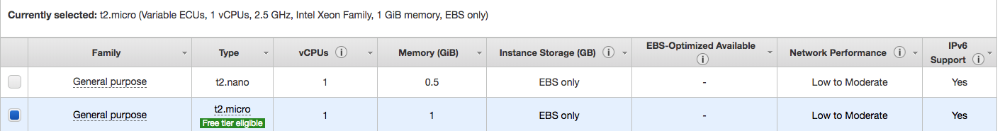
  * Step 3: config instance detail
    * 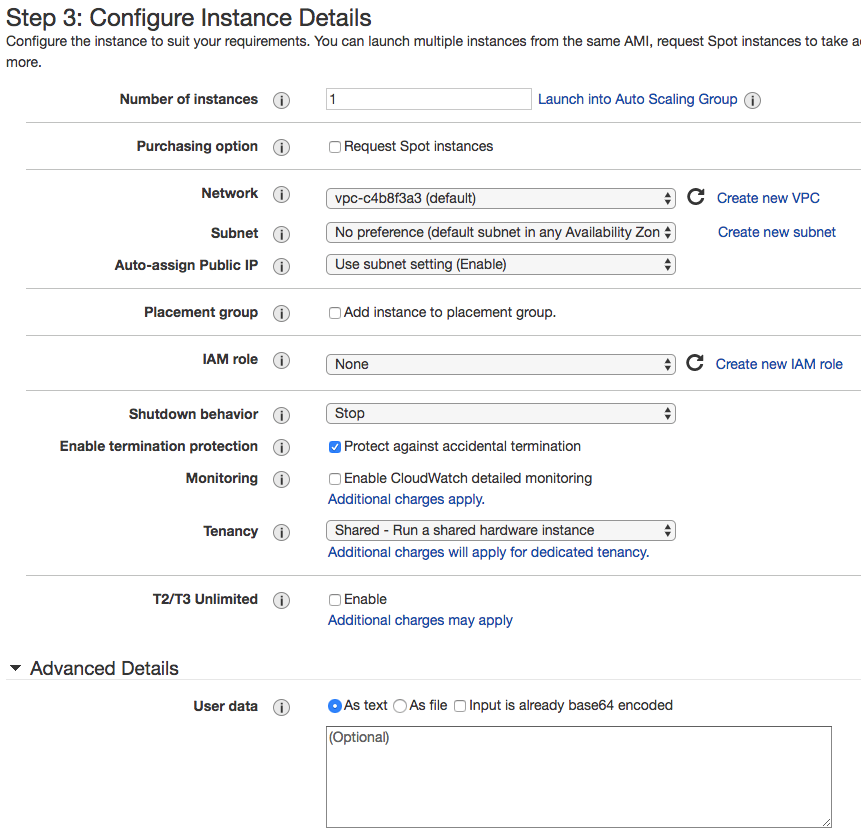
    * One subnet only belong to 1 availability zone
  * Step 4: add storage
    * 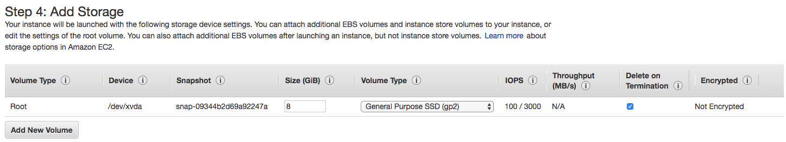
    * Check `Delete on Termination`
  * Step 5: add tag
    * 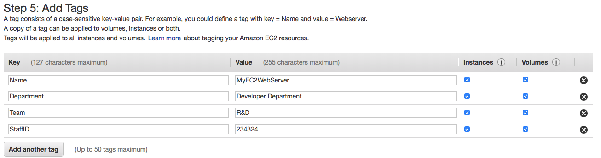
    * Really useful for optimise cost, and to see where you cost coming from
    * You should tag everything, as mush as possible
  * Step 6: config security group
    * It's virtual firewall
    * 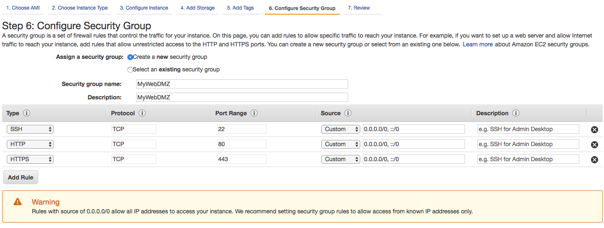
  * Step 7: review
    * 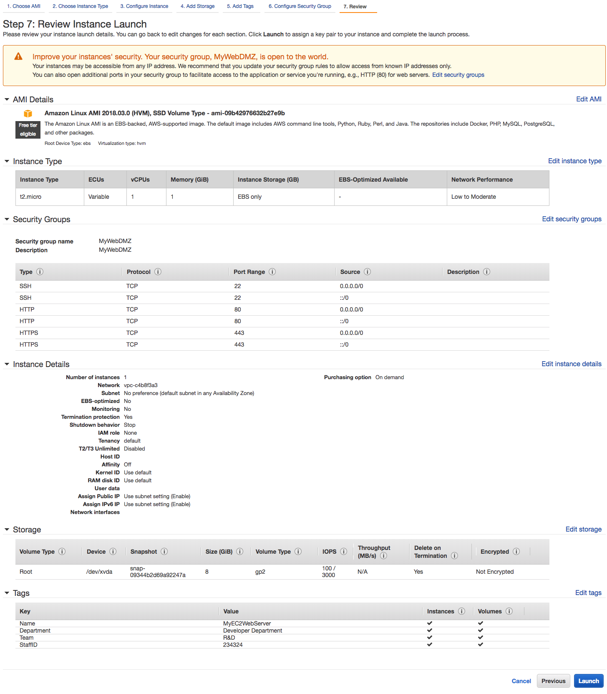
    * create key pair
      * public key: the padlock
      * private key: the key
      * 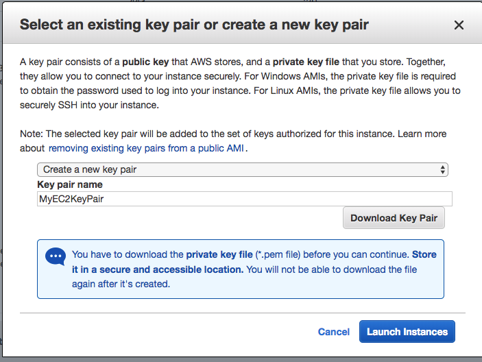
  * Launch Status
   * 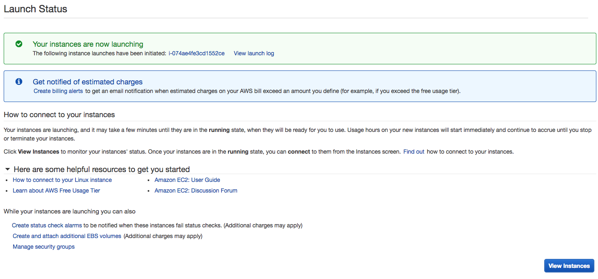
   * Status
     * 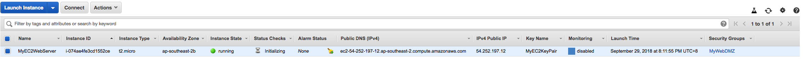

* Access EC2 instance
  * change mode of private key: `chmod 400 MyEC2KeyPair.pem`
  * ssh into it: `ssh ec2-user@11.22.33.44 -i MyEC2KeyPair.pem`
  * change to root: `sudo su`
  * apply security update: `yum update -y`
  * install a httpd: `yum install httpd -y`
  * create a file in `/var/www/html/index.html` with content `<html><h1>Hello AWS!</h1></html>`
  * start htppd: `service httpd start`
  * make sure service start on reboot: `chkconfig httpd on`
  * You get:
    * 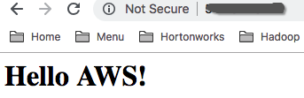

* Status Checks Tab
  * 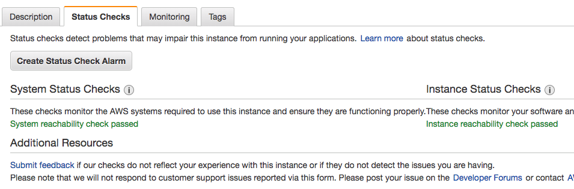
  * System Status Checks
    * 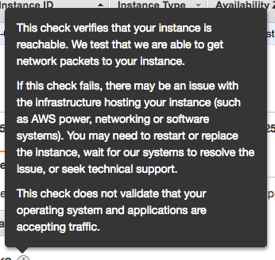
  * Instance tatus Checks
    * 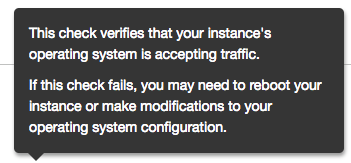  

* Monitoring Tab
  * Basic monitoring is every 5 mins
  * We can turn on detail monitoring, which is every 1 min, will cost a little bit extra
  * 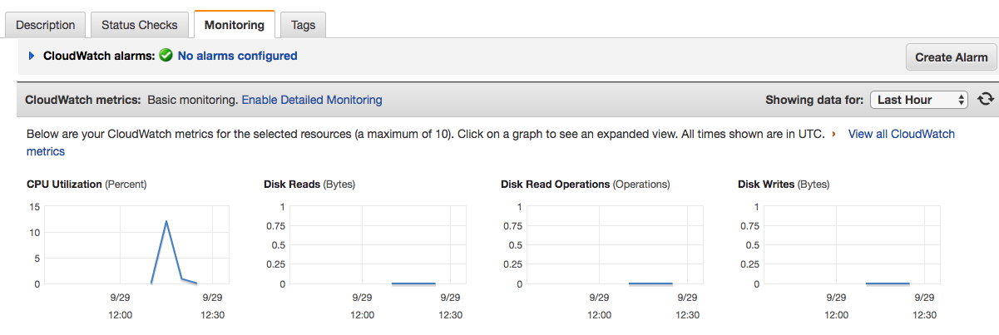

* Tips 1
  * 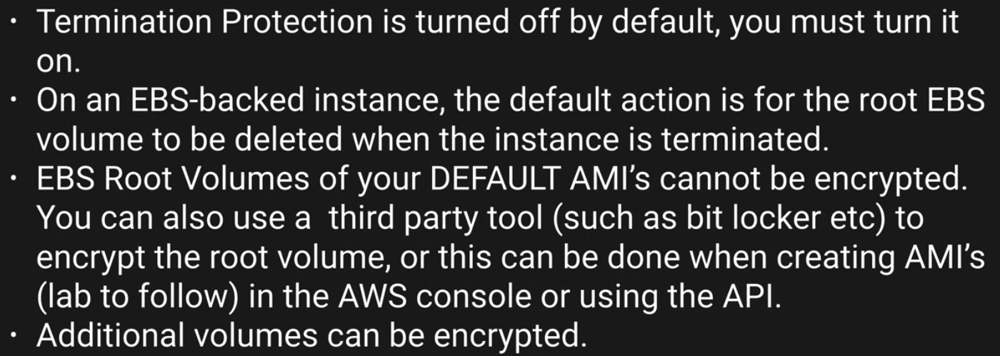

* Security Group
  * A virtual firewall
  * rules apply immediately
  * security group is stateful
  * everything is blocked by default
  * 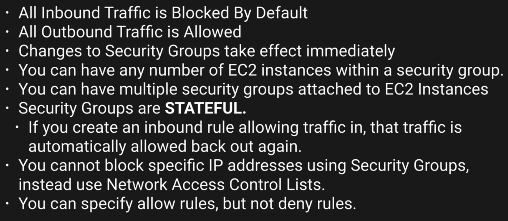

* EBS, Volumes & Snapsots
  * 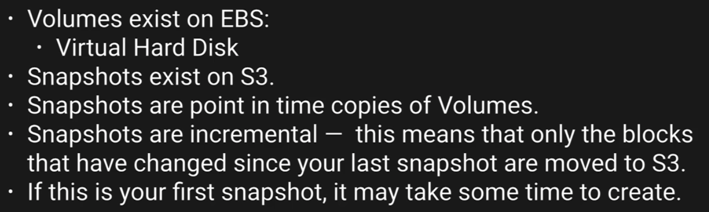
  * 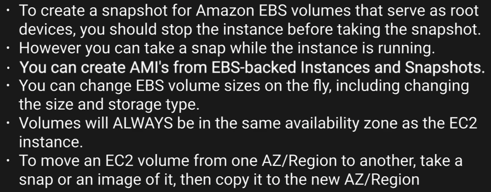
  * 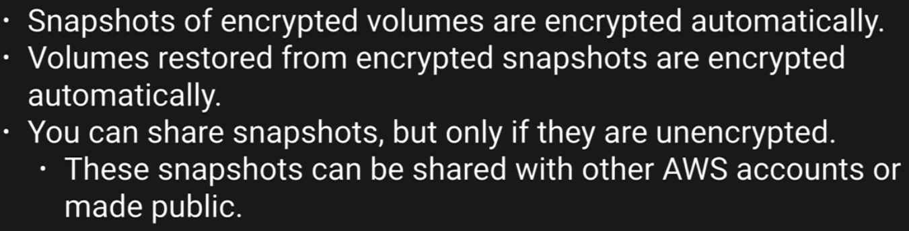

* RAID, Volumes, Snapshots
  * 
