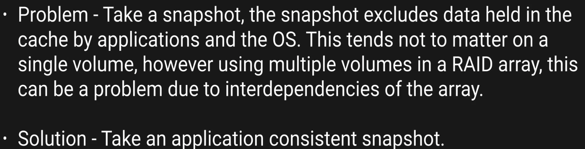
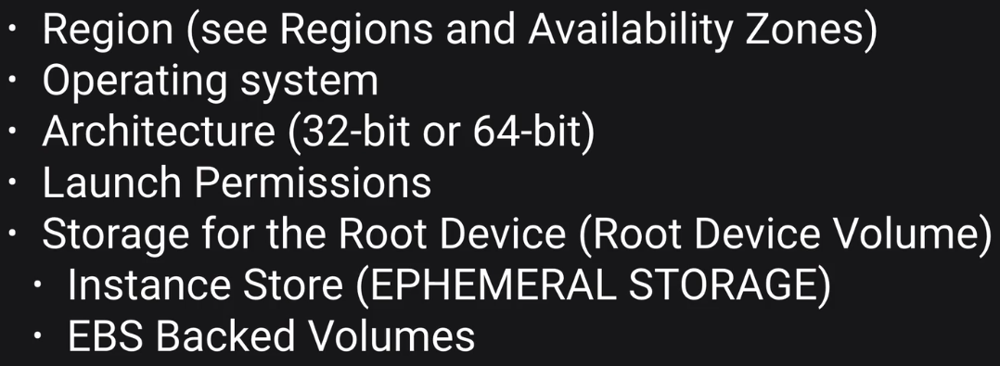
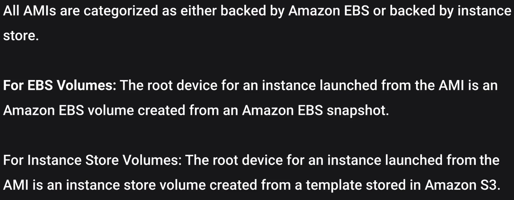
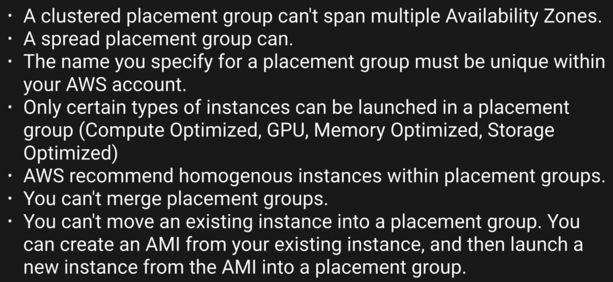

# EC2

* EC2 instance types


* EC2 cost model

  * Spot
    * 

* FightDrMcPX


* EBS
  * A virtual disk
  * a block device
  * are placed in a specific availability zone, are automatically replicated to protect you from the failure of a single component
  * Types
    * SSD
      * General Purpose SSD (GP2)
        * balance both price and performance
        * ratio of 3 IOPS (I/O per second) per GB with up to 10,000 IOPS and the ablility to burst up to 3000 IOPS for extended periods of time for volumes at 3334 GiB and above.
      * Provisioned IOPS SSD (IO1)
        * Designed for I/O intensive applications such as large relational or NoSQL DB
        * Use if you need more than 10,000 IOPS
        * Can provision up to 20,000 IOPS per volume
    * Magnetic
      * Throughput Optimized HDD(ST1)
        * Big data
        * Data warehouse
        * Log processing
        * Cannot be a boot volume
      * Cold HDD (SC1)
        * Lowest Cost Storage for infrequently accessed workloads
        * File Server
        * Cannot be a boot volume
      * Magnetic (Standard)
        * Lowest cost per gigabyte of all EBS volume types that is bootable.
        * Magnetic volumes are ideal fro workloads where data is accessed infrequently, and applications where the lowest storage cost is important
        * Previous Generation
    * 

* EC2 latency test
  * https://www.cloudping.info/
  * In Perth AU
    *  

* Lunch EC2 instance
  * Step 1: choose AMI
    * 
    * We need AWS command line tool, this AMI have many pre-build packages.
  * Step 2: choose instance type
    * Using t2.micro with free tier eligible
    * 
  * Step 3: config instance detail
    * 
    * One subnet only belong to 1 availability zone
  * Step 4: add storage
    * 
    * Check `Delete on Termination`
  * Step 5: add tag
    * 
    * Really useful for optimise cost, and to see where you cost coming from
    * You should tag everything, as mush as possible
  * Step 6: config security group
    * It's virtual firewall
    * 
  * Step 7: review
    * 
    * create key pair
      * public key: the padlock
      * private key: the key
      * 
  * Launch Status
   * 
   * Status
     * 

* Access EC2 instance
  * change mode of private key: `chmod 400 MyEC2KeyPair.pem`
  * ssh into it: `ssh ec2-user@11.22.33.44 -i MyEC2KeyPair.pem`
  * change to root: `sudo su`
  * apply security update: `yum update -y`
  * install a httpd: `yum install httpd -y`
  * create a file in `/var/www/html/index.html` with content `<html><h1>Hello AWS!</h1></html>`
  * start htppd: `service httpd start`
  * make sure service start on reboot: `chkconfig httpd on`
  * You get:
    * 

* Status Checks Tab
  * 
  * System Status Checks
    * 
  * Instance tatus Checks
    *   

* Monitoring Tab
  * Basic monitoring is every 5 mins
  * We can turn on detail monitoring, which is every 1 min, will cost a little bit extra
  * 

* Tips 1
  * 

* Security Group
  * A virtual firewall
  * rules apply immediately
  * security group is stateful
  * everything is blocked by default
  * 

* EBS, Volumes & Snapsots
  * 
  * -
  * 
  * -
  * 

* RAID, Volumes, Snapshots
  * Remember the Lab using Windows Server 2016 to Create a RAID0 Array
  * Question: How can I take a Snapshot of a RAID Array?
  * 
    * Stop the application from wrting to disk
    * Flash all caches to the disk
    * How can we do this?
      * Freeze the file system
      * Unmount the RAID Array
      * Shutting down the associated EC2 instance.

* Encrypted Root Device Volumes & Snapshots
  * Stop instance for consistency
  * Create a snapshot
  * Copy snapshot to another Region
    * You can encryption this snapshot
  * Change region to find the newly copied snapshot
  * Create a image from this EBS snapshot
  * Use this image to boot a ec2 instance which root volume is encrypted
  * Tips
    * To create a snapshot for Amazon EBS volumes that serve as root devices, you should stop the instance before taking the snapshot
    * Snapshots of encrypted volumes are encrypted automatically
    * Volumes restored from encrypted snapshots are encrypted automatically
    * You can share snapshots, but only if they are unencrypted
      * these snapshots can be shared with other AWS accounts or made public

* AMI Types (EBS vs Instance Store)
  * You can select your AMI based on
    * 
      * instance store can't be stop, only terminate and restart, get less durability
  * EBS vs Instance Store
    * 
  * tips
    * 


## Using Bootstrap Script

You can run your custom command during instance boot:

```
#!/bin/bash
yum install httpd -y
yum update -y
aws s3 cp s3://YOURBUCKETNAMEHERE/index.html /var/www/html/
service httpd start
chkconfig httpd on
```

## Get ec2 instance metadata

```
curl http://169.254.169.254/latest/meta-data/public-ipv4 # Give IPv4
curl http://169.254.169.254/latest/meta-data/user-data # Give you the bootstrap script
```

## Autoscaling

* Launch configuration
* Auto scaling groups

## EC2 placement group

* Cluster placement group
  * Big data
* Spread placement group
  * Two important instance in different AZ(distinct underlying hardware)
* 

## EFS(NFS)
