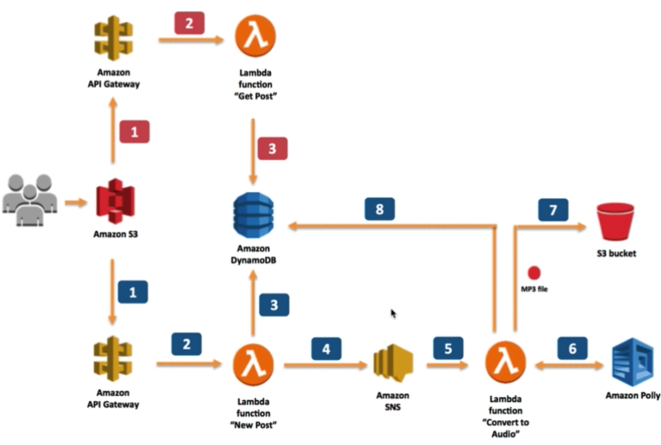

# Using Polly to make a server-less service

Arch

* 

Create DynamoDB table
* table: posts
* key: id

Create S3 bucket
* datasci.guru
* text2mp3bucket


Create Policy

* use following JSON to create myPollyLambdaPolicy

```
{
   "Version": "2012-10-17",
   "Statement": [
       {
           "Effect": "Allow",
           "Action": [
                "polly:SynthesizeSpeech",
                "dynamodb:Query",
                "dynamodb:Scan",
                "dynamodb:PutItem",
                "dynamodb:UpdateItem",
                "sns:Publish",
                "s3:PutObject",
                "s3:PutObjectAcl",
                "s3:GetBucketLocation",
                "logs:CreateLogGroup",
                "logs:CreateLogStream",
                "logs:PutLogEvents"
           ],
           "Resource": [
               "*"
           ]
       }
   ]
}
```

Create role
* lambda to sns
* lambda to execute
* lambda to dynamodb
* lambda to s3
* Use the Policy we have created: myPollyLambdaRole

Change S3 bucket policy

* To allow all object we put there is public

```
{
	"Version": "2012-10-17",
	"Statement": [
		{
			"Sid": "PublicReadGetObject",
			"Effect": "Allow",
			"Principal": "*",
			"Action": [
				"s3:GetObject"
			],
			"Resource": [
				"arn:aws:s3:::datasci.guru/*"
			]
		}
	]
}
```

Create SNS
* create a new topic
  * topic name: new_posts
