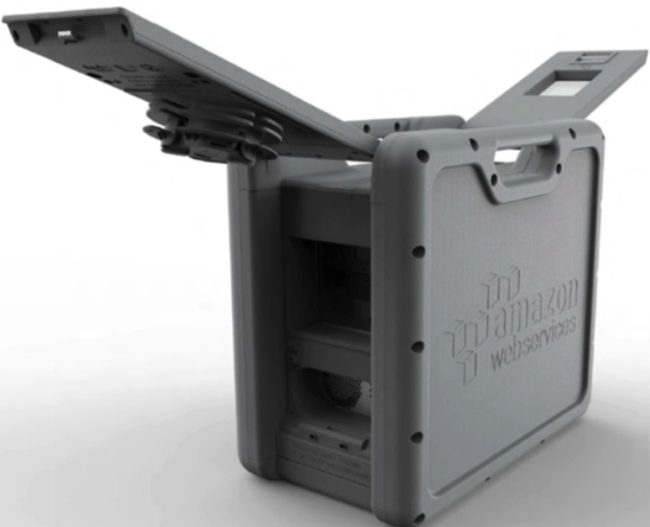

# Snowball

* Snowball

  * A snowball closed:
  * 

  * A snowball opened:
  * 

  * A real snowball
  * 

  * A real snowball back
  * 

  * A real snowball screen
  * 

  * Used to call Import Export

  * Import Export to from S3

  * Snowball is a petabyte-scale data transport solution that uses secure appliances to transfer large amounts of data into and out of AWS. Using Snowball addresses common challenges with large-scale data transfer including high network costs, long transfer times, and security concerns. Transferring data with Snowball is simple, fast, secure, and can be as little as `1/5` the cost of high-speed internet.

  * 80TB snowball in all regions. Snowball uses multiple layers of security designed to protect your data including tamper-resistant enclosures, 256-bit encryption, and an industry-standard Trusted Platform Module(TPM) designed to ensure both security and full chain-of-custody of you data. Once the data transfer job has been processed and verified, AWS performs a software erasure of the Snowball appliance.

* Snowball Edge
  * looks same as Snowball
  * 100TB
  * with compute capabilities
  * as a temporary storage tier
  * snowball edge can cluster together to form a local storage tier and process your data on-premises, helping ensure your appliances continue to run even when they are not able to access the cloud.
  * more or less a aws data center that you can bring on premise
  * run lambda function
  * aircraft can deploy snowball edge onto airplanes and collect data around how that aircraft engine is running

* Snowmobile
  * 
  * Petabyte or even Exabyte of data
  * 100 PB per Snowmobile
  * A 45-foot long ruggedised shipping container, pulled by a semi-trailer truck
  * even a entire data center migration

* example
  * `snowball start -i 192.168.1.xx -m xxx_manifest.bin -u credential`
  * `snowball cp hello.txt s3://bucket_name`
  *
