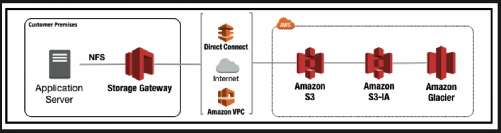
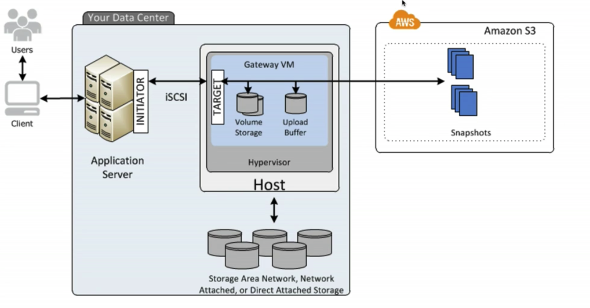
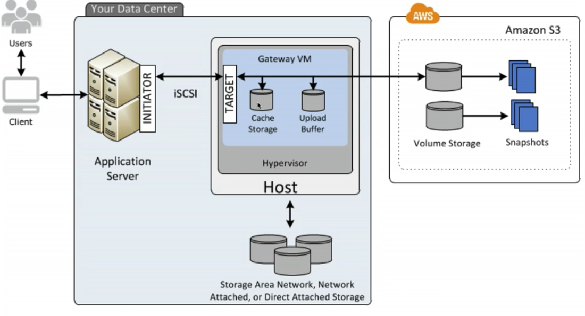
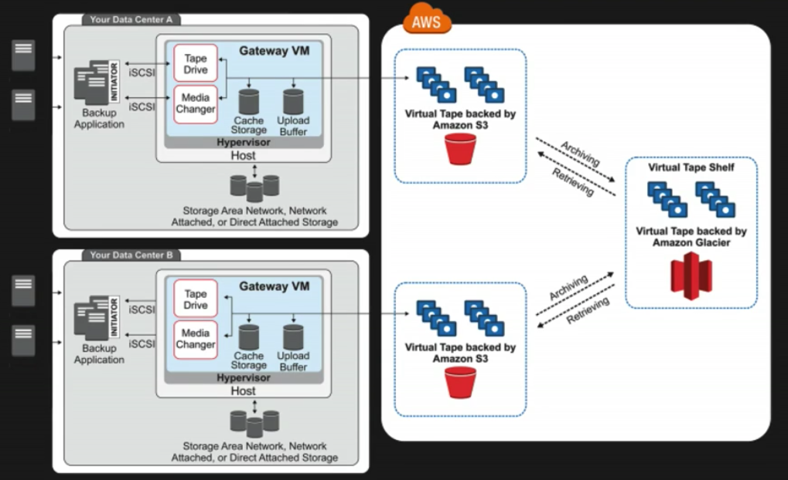

# Amazon Storage Gateway

AWS Storage Gateway is a service that connects an on-premises software appliance with cloud-based storage to provide seamless and secure integration between an organisation's on-premises IT environment and AWS's storage infrastructure. The service enables you to securely store data to the AWS cloud for scalable and cost-effective storage.

* basically storage gateway is a `virtual appliance` that install into hypervisor running in your data center and then that virtual clients who then propagate or asynchronously replicate your information up to AWS and in particular to S3 as well as potentially `Glacial` depending on what `Storage Gateway` appliance that you're using.

* AWS Storage Gateway's software appliance is available for download as a virtual machine(VM) image that you install on a host in your datacenter. `Storage Gateway` supports either `VMware ESXi` or `Microsoft Hyper-V`. Once you've installed your gateway and associated it with your AWS account through the activation process, you can use the AWS Management Console to create the storage gateway option that is right for you.

Four Types of Storage Gateways
* File Gateway(NFS)
* Volumes Gateway(iSCSI)
 * Stored Volumes
 * Cached Volumes
* Tape Gateway(VTL)

File Gateway
* Files are stored as objects in your S3 buckets, accessed through a Network File System (NFS) mount point. `Ownership`, `permissions`, and `timestamps` are durably stored in S3 in the `user-metadata` of the object associated with the file. Once Object are transferred to S3, they can be managed as native S3 objects, and bucket policies such as versioning, lifecycle management, and cross-region replication apply directly objects stored in your bucket.
* You don't store file on-prem, all file in S3
* 

Volume Gateway
* The volume interface presents your applications with disk volumes using the iSCSI block protocol.
* Data written to these volumes can be asynchronously backed up as point-in-time snapshots of your volumes, and stored in the cloud as Amazon EBS(elastic block store) snapshots.
* Snapshots are incremental backups that capture only changed block. All snapshot storage is also compressed to minimise your storage charges.
* think of this as a `virtual hard disk`
* Stored Volumes
  * Stored volumes let you store your `primary data` locally, while asynchronously backing up that data to AWS. Stored volumes provide you on-premises applications with low-latency access to their entire datasets, while providing durable, off-site backup. You can create storage volumes and mount them as iSCSI devices from you on-premises application servers. Data written to your stored volumes is stored on your on-premises storage hardware. This data is asynchronously backed up to S3 in the form of `Amazon Elastic Block Store (EBS)` snapshots. 1GB-16TB in size for Stored Volumes.
 * 

* Cached Volumes
  * Cached Volumes let you use S3 as your `primary data storage` while retaining frequently accessed data locally in your storage gateway. Cached volumes minimise the need to scale your on-premises storage infrastructure, while still providing your applications with low-latency access to their frequently accessed data. You can create storage volumes up to 32TB in size and attach to them as iSCSI device from your on-premises application servers. Your gateway stores data that you write to these volumes in S3 and retains recently read data in your on-premises storage gateway's cache and upload buffer storage. 1GB-32TB in size for Cached Volumes.
  * You don't keeping all data on-prem
  * You only keeping the most recently read data on-prem
  * 

Tape Gateway
* Tape Gateway offers a durable, cost-effective solution to archive your data in the aws cloud. The VTL interface it provides lets you leverage your existing tape-based backup application infrastructure to store data on virtual tape cartridges that you create on your tape gateway. Each tape gateway is preconfigured with a media changer and tape drives, which are available to your existing client backup application as iSCSI devices. You add tape cartridges as you need to archive your data. Supported by NetBackup, Backup Exec, Veeam etc.
* Just use virtual tape instead of physical tape, which sending to S3
* 

Wrap up
* File gateway - for flat files, stored directly on S3, image file, pdf file, not os file, db file
* Volume Gateway
  * Stored Volumes - Entire Dataset is stored on site and is asynchronously backed up to S3
    * Need fast access for local analyse
  * Cached Volumes - Entire Dataset is stored on S3 and the most frequently accessed data is cached on site
* Gateway Virtual Tape Library(VTL)
  * Used for backup and uses popular backup applications like NetBackup, Backup Exec, Veeam etc
