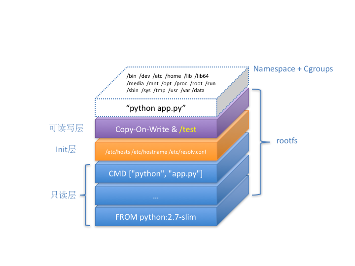

# Container 101

* Docker only package file system, not OS core
* Docker is a open source project, also a Company now
* Fig is acquired by Docker, then change name to Compose
* Mesos + Marathon: PaaS, both for application and big data
* Mesos is two level scheduler, framework + scheduler
* Mesosphere: DC/OS, which user can manager their big cluster like a single machine
* RedHat: old Docker contributor, but their openshift cannot compete Docker Swarm and Mesos
* RedHat not satisfy Docker's platform strategy
* Google release kubernetes helps RedHat and CoreOS
* Google previously have a lmctfy(let me container that for you), but failed
* CoreOS has etcd
* Kubernetes: Google+RedHat
* CNCF:
  * kubernetes
  * Prometheus
  * Fluentd
  * OpenTracing
  * CNI
  * Istio
  * Operator: Stateful apps deployment
  * Rook: add Ceph for storage

## Container basic: From Process to Docker Container

* Give me a container, and run `/bin/sh` in it, and give me a console to communicate with it:
  * `docker run -it busybox /bin/sh`
* Container is just a special process
* There is no real Docker container actually run in the host
* Only create process with many `Namespace` parameter.
  * `int pid = clone(main_function, stack_size, CLONE_NEWPID | SIGCHLD, NULL);`
  * VS
  * `int pid = clone(main_function, stack_size, SIGCHLD, NULL);`
* Wrong
  * 
* Right:
  * 


## Container basic: Separation(Namespace) and Constraint(cgroup)
* Cgroup: Linux Control Group
  * CPU
  * Memory
  * Disk
  * Network IO

## Deep in to Container Image

Docker core:
* Launch Linux Namespace configuration
* Config cgroup
* exchange process rootfs
  * rootfs only have file, etc, folder, don't have linux core
  * OS only load core during boot up
  * All container in a host share same linux core
  * So if your app need to config core parameter or extra core plugin module, or communicate with core, it will impact on all containers on this host
  * It's a big different between VM, VM have virtual hardware and complete Guest OS.
  * And it's advantage is a key feature: consistency, `rootfs` provided consistency
* Ubuntu:lastest image
  * 
* docker commit and push command is to save the top read/write layer, and upload it to Docker Hub
* Init layer will save `/etc/hosts, /etc/resolv.conf` etc, this thing don't want to be included in `docker commit`
* Docker image is the core power during 2014~2016 for Docker community. It made `dev-test-deploy` together. And change the future App distribution way: Through Docker Image
* Docker on Mac, Windows Docker(Hyper-V) is totally different then Linux Docker.
* docker commit will not include the mount volume outside container, it will only contains the empty folder of the volume mounting point
* Docker container Flask App view:
  * 


## K8S
* K8S knowledge point
  * 
* Google's Brog/Omega
  * From 2015 April
  * 
* K8S arch
  * 
* K8S core concept
  * 
* Container have 2 main parts
  * Container runtime
  * Container images
* K8s using `声明式 API` to declare the relationship between containerised task and container
* Yarn/Mesos/Swarm focus on based on some rules, put a container to the best nodes, it's a `scheduler`.
* K8s focus on based on user's purpose and system's rule, automatically handle the relationship between containers, it's a `orchestration`.

## Deploy K8S

### Prepare

* Linux with 3.1+ core, ubuntu 16.04
* x86 or ARM
* need Internet access
* need access gcr.io, quay.io docker registry
* node spec
  * 2 cpu
  * 8GB Mem
  * 30GB disk for docker image and log
* Procedure
  1. install Docker and kubeadm on all nodes
  2. deploy kubernetes master
  3. deploy container network plugin
  4. deploy kubernetes worker
  5. deploy dashboard visualisation plugin
  6. deploy container plugin

### Install Kubeadm and Docker

Install kubeadm, kubelet, kubectl, kubenetes-cni:

```bash
curl -s https://packages.cloud.google.com/apt/doc/apt-key.gpg | apt-key add -
cat <<EOF > /etc/apt/sources.list.d/kubernetes.list
deb http://apt.kubernetes.io/ kubernetes-xenial main
EOF

apt-get update
apt-get install -y docker.io kubeadm

# using 1.11
apt remove kubelet kubectl kubeadm
apt install kubelet=1.11.3-00
apt install kubectl=1.11.3-00
apt install kubeadm=1.11.3-00

```

## deploy k8s master

YAML for kubeadm

```Yaml
apiVersion: kubeadm.k8s.io/v1alpha1
kind: MasterConfiguration
controllerManagerExtraArgs:
  horizontal-pod-autoscaler-use-rest-clients: "true"
  horizontal-pod-autoscaler-sync-period: "10s"
  node-monitor-grace-period: "10s"
apiServerExtraArgs:
  runtime-config: "api/all=true"
kubernetesVersion: "stable-1.11"

```

Disable swap

```bash
run swapoff -a #this will immediately disable swap
# remove any swap entry from /etc/fstab
```

```bash
kubeadm init --config kubeadm.yaml

```

Config security

```
mkdir -p $HOME/.kube
sudo cp -i /etc/kubernetes/admin.conf $HOME/.kube/config
sudo chown $(id -u):$(id -g) $HOME/.kube/config
```

Try `kubectl get nodes`

We get:

```
root@gpuserver:~/study/k8s# kubectl get nodes
NAME        STATUS     ROLES     AGE       VERSION
gpuserver   NotReady   master    2m        v1.11.3
```

Try `kubectl describe node gpuserver`

We know network plugin not be deployed

Try `kubectl get pods -n kube-system`

* kube-system is a work space (Namespace)

We can also know coredns is pending, it means the network is not ready.

## Deploy network plugin

```bash
kubectl apply -f https://git.io/weave-kube-1.6
```

After awhile, 30s

Try `kubectl get pods -n kube-system`

We know coredns is Running now, and there is a `weave-net-hpqcj` be created under `kube-system`

Kubernetes support network plugin, using CNI.

Current container network project have:
* Flannel
* Calico
* Canal
* Romana
* Weave

## Deploy k8s worker node

Easy than Master

Master will run 3 Pod
* kube-apiserver
* kube-scheduler
* kube-controller-manager

Worker only need to

1. Install kubeadm and docker
2. Run the join

```
kubeadm join 192.168.1.71:6443 --token cd65vo.o1i01kmpannt4g6c --discovery-token-ca-cert-hash sha256:043c9c0ad7580a4fe6062db8614bfbce717a88d6b35c69b50484c702e666
```

## Config Taint/Toleration to let Master run user Pod

Using a single node k8s

```
kubectl taint nodes --all node-role.kubernetes.io/master-
```

## Deploy Dashboard

```
kubectl apply -f https://raw.githubusercontent.com/kubernetes/dashboard/master/src/deploy/recommended/kubernetes-dashboard.yaml
```

Try `kubectl get pods -n kube-system`

We can see dashboard is running

## Deploy container storage plugin

* Container Consistency Storage

Storage plugin will mount a network or distributed volume in container. So the data volume is not bind with any host.

Current following project can provide k8s with consistency storage
* Ceph
* GlusterFS
* NFS
* Rook

We will use `Rook` as our storage plugin, which is a wrap of Ceph, but have horizontal scalability, disaster recovery, data migration, monitoring etc. enterprise function.


```
kubectl apply -f https://raw.githubusercontent.com/rook/rook/master/cluster/examples/kubernetes/ceph/operator.yaml

kubectl apply -f https://raw.githubusercontent.com/rook/rook/master/cluster/examples/kubernetes/ceph/cluster.yaml

```

Try `get pods -n rook-ceph-system` and `kubectl get pods -n rook-ceph` to check the Pods in two namespace separately
