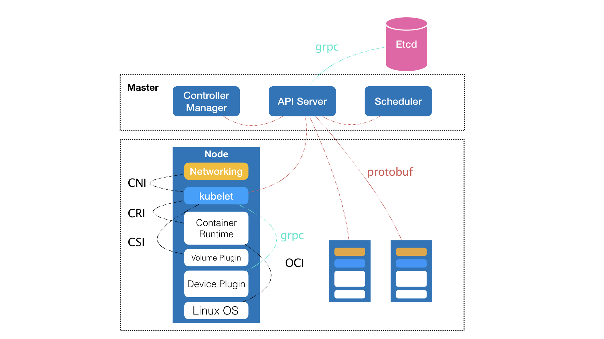

# Container 101

* Docker only package file system, not OS core
* Docker is a open source project, also a Company now
* Fig is acquired by Docker, then change name to Compose
* Mesos + Marathon: PaaS, both for application and big data
* Mesos is two level scheduler, framework + scheduler
* Mesosphere: DC/OS, which user can manager their big cluster like a single machine
* RedHat: old Docker contributor, but their openshift cannot compete Docker Swarm and Mesos
* RedHat not satisfy Docker's platform strategy
* Google release kubernetes helps RedHat and CoreOS
* Google previously have a lmctfy(let me container that for you), but failed
* CoreOS has etcd
* Kubernetes: Google+RedHat
* CNCF:
  * kubernetes
  * Prometheus
  * Fluentd
  * OpenTracing
  * CNI
  * Istio
  * Operator: Stateful apps deployment
  * Rook: add Ceph for storage

## Container basic: From Process to Docker Container

* Give me a container, and run `/bin/sh` in it, and give me a console to communicate with it:
  * `docker run -it busybox /bin/sh`
* Container is just a special process
* There is no real Docker container actually run in the host
* Only create process with many `Namespace` parameter.
  * `int pid = clone(main_function, stack_size, CLONE_NEWPID | SIGCHLD, NULL);`
  * VS
  * `int pid = clone(main_function, stack_size, SIGCHLD, NULL);`
* Wrong
  * 
* Right:
  * 

## Container basic: Separation(Namespace) and Constraint(cgroup)
* Cgroup: Linux Control Group
  * CPU
  * Memory
  * Disk
  * Network IO

## Deep in to Container Image

Docker core:
* Launch Linux Namespace configuration
* Config cgroup
* exchange process rootfs
  * rootfs only have file, etc, folder, don't have linux core
  * OS only load core during boot up
  * All container in a host share same linux core
  * So if your app need to config core parameter or extra core plugin module, or communicate with core, it will impact on all containers on this host
  * It's a big different between VM, VM have virtual hardware and complete Guest OS.
  * And it's advantage is a key feature: consistency, `rootfs` provided consistency
* Ubuntu:lastest image
  * 
* docker commit and push command is to save the top read/write layer, and upload it to Docker Hub
* Init layer will save `/etc/hosts, /etc/resolv.conf` etc, this thing don't want to be included in `docker commit`
* Docker image is the core power during 2014~2016 for Docker community. It made `dev-test-deploy` together. And change the future App distribution way: Through Docker Image
* Docker on Mac, Windows Docker(Hyper-V) is totally different then Linux Docker.
* docker commit will not include the mount volume outside container, it will only contains the empty folder of the volume mounting point
* Docker container Flask App view:
  * 

## K8S
* K8S knowledge point
  * 
* Google's Brog/Omega
  * From 2015 April
  * 
* K8S arch
  * 
* K8S core concept
  * 
* Container have 2 main parts
  * Container runtime
  * Container images
* K8s using `声明式 API` to declare the relationship between containerised task and container
* Yarn/Mesos/Swarm focus on based on some rules, put a container to the best nodes, it's a `scheduler`.
* K8s focus on based on user's purpose and system's rule, automatically handle the relationship between containers, it's a `orchestration`.
