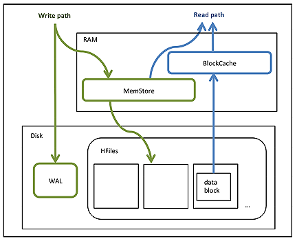
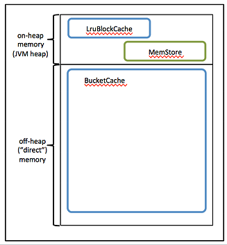

# HBase General

## Some concept

HFile:
> An HFile contains table data, indexes over that data, and metadata about the data.

Block:
> An HBase block is the smallest unit of data that can be read from an HFile. Each HFile consists of a series of blocks. (Note: an HBase block is different from an HDFS block or other underlying file system blocks.)

BlockCache:
> BlockCache is the main HBase mechanism for low-latency random read operations. BlockCache is `one of two memory cache structures` maintained by HBase. When a block is `read` from HDFS, it is cached in BlockCache. Frequent access to rows in a block cause the block to be kept in cache, improving read performance.

MemStore:
> MemStore ("memory store") is in-memory storage for a RegionServer. MemStore is the `second of two cache structures maintained by HBase`. MemStore improves `write` performance. It accumulates data until it is full, and then writes ("flushes") the data to a new `HFile` on disk. MemStore serves two purposes: it increases the total amount of data written to disk in a single operation, and it retains recently written data in memory for subsequent low-latency reads.

Write Ahead Log (WAL):
> The WAL is a log file that records all changes to data until the data is successfully written to disk (MemStore is flushed). This protects against data loss in the event of a failure before MemStore contents are written to disk.

## HBase write procedure

> When something is written to HBase, it is first written to an in-memory store `MemStore`, once this MemStore reaches a certain size, it is flushed to disk into a `StoreFile(HFile)` (everything is also written immediately to a log file for durability). The StoreFiles created on disk are immutable. Sometimes the StoreFiles are merged together, this is done by a process called `Compaction`.

Another explaination:

> When the `MemStore` reaches a given size `hbase.hregion.memstore.flush.size`, it flushes its contents to a `StoreFile(HFile)`. The number of StoreFiles in a Store increases over time. `Compaction` is an operation which reduces the number of StoreFiles in a Store, by merging them together, in order to increase performance on read operations. Compactions can be resource-intensive to perform, and can either help or hinder performance depending on many factors. Compactions fall into two categories: `minor and major`.

## HBase Read/Write Operation

BlockCache and MemStore reside in random-access memory (RAM). HFiles and the Write Ahead Log are persisted to HDFS.

The following figure shows these simplified write and read paths:

* During write operations, HBase writes to WAL and MemStore. Data is flushed from MemStore to disk according to size limits and flush interval.
* During read operations, HBase reads the block from BlockCache or MemStore if it is available in those caches. Otherwise, it reads from disk and stores a copy in BlockCache.

## HBase Memory allocation

By default, `BlockCache` resides in an area of RAM that is managed by the `Java Virtual Machine (JVM) garbage collector`; this area of memory is known as `on-heap` memory or the JVM heap. The BlockCache implementation that manages the on-heap cache is called `LruBlockCache`.

If you have stringent read latency requirements and you have more than 20 GB of RAM available on your servers for use by HBase RegionServers, consider configuring `BlockCache` to use both `on-heap` and `off-heap` memory. `BucketCache` is the off-heap memory equivalent to LruBlockCache in on-heap memory. Read latencies for BucketCache tend to be less erratic than LruBlockCache for large cache loads because BucketCache (not JVM garbage collection) manages block cache allocation. The MemStore always resides in the on-heap memory.

Additional notes:

* BlockCache is enabled by default for all HBase tables.
* BlockCache is beneficial for both random and sequential read operations although it is of primary consideration for random reads.
* All regions hosted by a RegionServer share the same BlockCache.
* You can turn BlockCache caching on or off per column family.