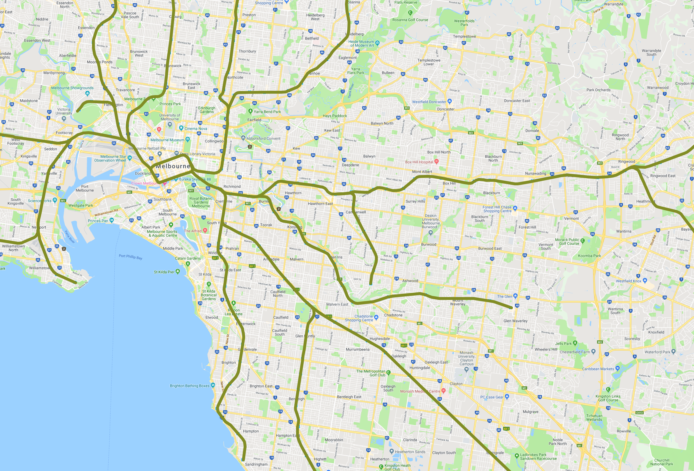
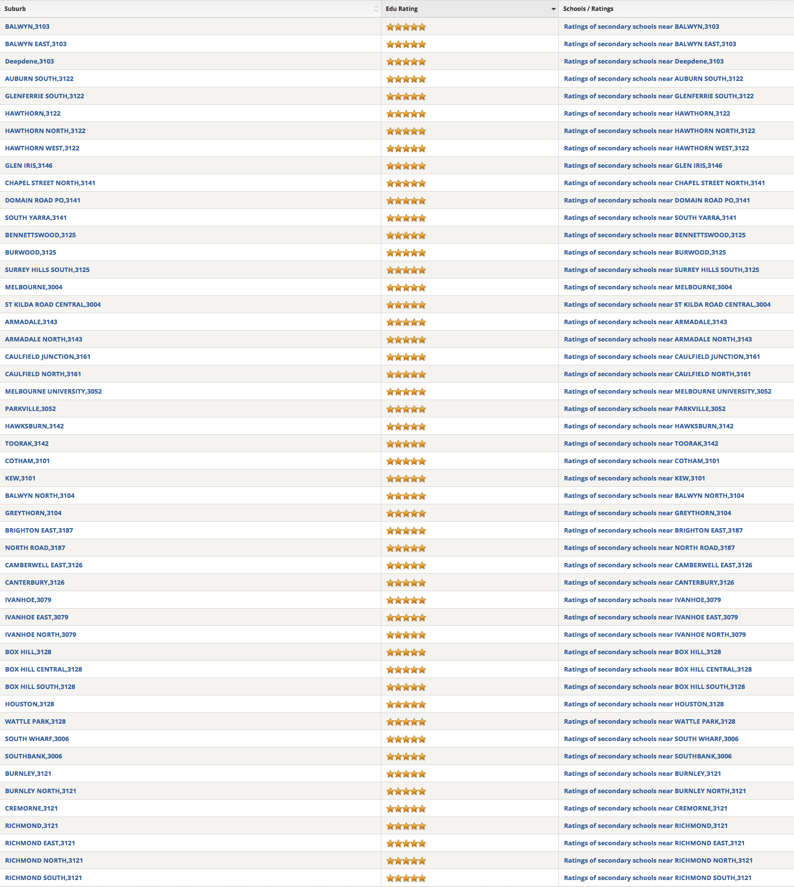

# Melbourne

* Lilydale
* Belgrave
* Glen Waveley
* Alamein
* Cranbourne
* Pakenham
* Frankston

## Suburb

## Train Line

## School Zone
* Primary Boy

* Primary Girl

* Secondary Boy

* Secondary Girl

## Tram Line

## Suburb Primary Rating top 50

## Suburb Secondary Rating top 50

## School Primary Rating top 50

## School Secondary Rating top 50

## School Government top

## School Non-Government top

