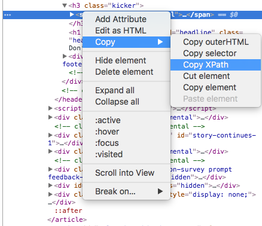

# Scrapy

## scrapy shell to get the content

``` python
fetch("https://www.myschool.edu.au/school/50503")
sel.xpath('//*[@id="body-area"]/div[2]/section[1]/div[1]/ul/li[1]/div[2]').extract()
```

Or we can

> `scrapy shell 'http://quotes.toscrape.com/'`

## Create a project

> `scrapy startproject quotes_spider`

## Gen spider belong to this project

> `cd quotes_spider`
> `scrapy genspider example example.com`
> `scrapy genspider quotes quotes.toscrape.com`
> `scrapy genspider myschool www.myschool.edu.au/school/50503`

## List spider

> `scrapy list`

## Edit spider

```python
# -*- coding: utf-8 -*-
import scrapy

class MyschoolSpider(scrapy.Spider):
    name = 'myschool'
    allowed_domains = ['www.myschool.edu.au/school/50503']
    start_urls = ['http://www.myschool.edu.au/school/50503/']

    def parse(self, response):
      icsea_score = response.xpath('//*[@id="body-area"]/div[2]/section[1]/div[1]/ul/li[1]/div[2]/text()').extract()
      school_name = response.xpath('/html/body/div[1]/div/div[1]/div[1]/h1/text()').extract()

      yield {'School_Name': school_name, 'ICSEA_Score': icsea_score}
```

## Run scrapy spider

> `scrapy crawl myschool`

## Get result

```bash
2018-11-07 00:21:31 [scrapy.core.engine] INFO: Spider opened
2018-11-07 00:21:31 [scrapy.extensions.logstats] INFO: Crawled 0 pages (at 0 pages/min), scraped 0 items (at 0 items/min)
2018-11-07 00:21:31 [scrapy.extensions.telnet] DEBUG: Telnet console listening on 127.0.0.1:6023
2018-11-07 00:21:31 [scrapy.downloadermiddlewares.redirect] DEBUG: Redirecting (301) to <GET https://www.myschool.edu.au/school/50503/> from <GET http://www.myschool.edu.au/school/50503/>
2018-11-07 00:21:31 [scrapy.core.engine] DEBUG: Crawled (200) <GET https://www.myschool.edu.au/school/50503/> (referer: None)
2018-11-07 00:21:31 [scrapy.core.scraper] DEBUG: Scraped from <200 https://www.myschool.edu.au/school/50503/>
{'School_Name': [u'Glenroy Private, Glenroy, VIC'], 'ICSEA_Score': [u'929']}
2018-11-07 00:21:31 [scrapy.core.engine] INFO: Closing spider (finished)
```

## Find Xpath

1. Open the web page in Google Chrome.
2. Select the text portion you want to extract.
3. Right-click, and select "Inspect".
4. Select the HTML code you need, and select "Copy" and then "Copy XPath".
5. Paste the XPath to your code, test, and edit it, if necessary.
6. Note that this method copy the "id" but you can change it to the "class" of the same portion if that will work better.



## Current level of xpath

> `quote.xpath('.//a')``
